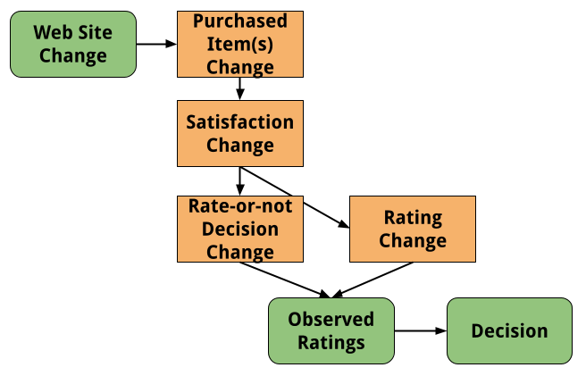

Suppose you're a data scientist at an e-commerce web site that
sells shoes, responsible for
supporting [A/B tests](https://en.wikipedia.org/wiki/A/B_testing). 
Many A/B tests are easy, and there are a number of
companies that sell tools that make the easy cases as simple as clicking a few
buttons and looking at pretty graphs. But A/B tests can get statistically
complex surprisingly quickly, which is why hiring data scientists with a 
strong statistics background can make a big difference in the quality of
decisions. 

This is the first in a short series of blog posts about situations that
can arise when testing changes that may affect _product ratings_, an 
important and ubiquitous part of e-commerce web sites.
For certain changes to our site, we may want to understand
not just whether users *purchase more*, but also whether they're more
*satisfied* with the items they purchase. There are several ways we
could potentially measure this, such as return-to-site rate, complaint
or refund rate, etc. But the most direct way to estimate
satisfaction is to look at the ratings that users provide.

However, when you're making changes to an e-commerce site, your interventions
can affect ratings in complex ways. This makes A/B testing tricky.



* The intervention could increase purchase rate or could change the
mix of items purchased.
* The intervention could directly, or indirectly (via purchase rate or
item mix), affect the true satisfaction of items acquired. We cannot
directly see true satisfaction.
* The intervention could directly or indirectly (via satisfaction) affect
the rate at which items are rated, either by affecting the eventual
asymptotic rate, or changing the timing of ratings.
* The intervention could directly or indirectly (via the above factors)
affect the rating given.

# Delayed and Biased Ratings

What if you're testing a change to the web site's user interface
that you expect will shift *which* items
are purchased, which in turn will affect *satisfaction*.
You care a lot about satisfaction, as it's closely tied to future purchase
rate! So, as
you're a savvy product analyst, you decide to A/B
test the interface change,
showing half of your users the old version, and half of your users the
new version. After a few weeks, you can look at what those users did
and make a decision to keep the interface change, or to roll it back.

But ratings are *delayed* and *incomplete* metrics.
If you order shoes from a web site, the earliest you'll rate the item
would be when you receive it, and more likely you'd rate it only after
several days or weeks. And you *might* only rate it three months later,
when you log back into the web site and are reminded of your past
orders.

Furthermore, different people with different experiences differ in how they
rate. Higher-priced items, where you spent a bunch of time reading
reviews, might lead to a higher likelihood to rate. Items that were
defective on arrival, or that were very disappointing, might lead to
early, negative ratings.

Whatever you measure at the end of your experiment is only an
approximation to the eventual ratings that will trickle in, and even those
ratings will be only an approximation of the true satisfaction of your
customers. All of these complexities affect the
[validity](https://www.scribbr.com/methodology/reliability-vs-validity/) of the
signal you're measuring in your A/B test.

Let's do a quick simulation. We don't need to have
a realistic model, just something to drive our intuitions. We'll make this
really simple:

* 10,000 people purchase a pair of shoes.
* Shoes are either cheap or expensive. Assume the purchase mix is 50/50.
* People can be unsatisfied, satisfied, or glowing about their purchase.
If they rate, they'll give 1, 2, or 3 stars, respectively.
* The cheap shoes are 20% likely to be unsatisfactory, and 20% likely to have
the purchaser be glowing.
* The expensive shoes are 10% likely to be unsatisfactory, and 40% likely to 
have the purchaser be glowing.
* Assuming the shoes are satisfactory, people will rate the expensive shoes
20% of the time, and the cheap shoes 10% of the time.
* Assuming the shoes are satisfactory, and if they've decided to rate,
people will rate early 50% of the time, 
and late 50% of the time.
* If the shoes are unsatisfactory _or_ if the purchaser is glowing, 
the likelihood to rate doubles, and the 
likelihood to rate early increases to 75%.
* The early reviews might be what you see after running an experiment,
while the later reviews might accumulate months later.

Here's some R code to simulate this. (Don't worry if you don't read R! 
It just implements the above and makes a graph of three views of the average
rating.)

```{r setup, include=FALSE}
library(tidyverse)
```

```{r sim1, echo=TRUE}
shoe_options = c('cheap', 'expensive')
sat_options = 1:3

sim_ratings <- function(ct=10000,
                        cheap_sat_prob=c(.2, .6, .2),
                        exp_sat_prob=c(.1, .5, .4),
                        rate_probs=c(.1, .2),
                        rate_mult=2,
                        late_probs=c(.5, .25)) {
  ret <- tibble(user=1:ct,
              shoes=sample(shoe_options, size=ct, replace=TRUE))

  ret %>%
    mutate(satisfaction=ifelse(shoes=='cheap',
                               sample(sat_options, size=ct,
                                      replace=TRUE, prob=cheap_sat_prob),
                               sample(sat_options, size=ct,
                                      replace=TRUE, prob=exp_sat_prob))) %>%
    mutate(rates_prob=ifelse(shoes=='cheap', rate_probs[[1]], rate_probs[[2]]) * 
             ifelse(satisfaction != 2, rate_mult, 1)) %>%
    mutate(rates_late_prob=ifelse(satisfaction != 2, 
                                  late_probs[[1]], late_probs[[2]])) %>%
    mutate(rates=rbinom(ct, 1, rates_prob),
           rates_late=rbinom(ct, 1, rates_late_prob))
}

sim1 <- sim_ratings()

res1 <- with(sim1, tribble(
  ~ name, ~value,
  "True", mean(satisfaction),
  "Early", mean(satisfaction[rates & !rates_late]),
  "Eventual", mean(satisfaction[as.logical(rates)])
))

theme_set(theme_minimal(base_size=16))

ggplot(res1, aes(name, value, label=sprintf('%0.2f', value))) +
  geom_point(size = 3, color = "black") + 
  geom_segment(aes(x=name, xend=name, y=0, yend=value)) +
  geom_text(nudge_y=.15) +
  scale_y_continuous("Average", limits=c(0,3)) +
  coord_flip() +
  labs("Simulation 1: Parameters in Text",
       x="Rating")

```

Even without fully simulating a realistic rating process and a realistic A/B 
test, and even without simulating uncertainty intervals, the
process of writing this simulation and running the code has caused us to
realize a few things:

* Ratings don't reflect true satisfaction. In this toy simulation,
only `r round(100*mean(sim1$rates))`\% of buyers will rate at all,
and only `r round(100*mean(with(sim1, rates & !rates_late)))`\% will rate
early enough to be observed during an experiment.
* If there are more people who are glowing than dissatisfied, 
and if having strong feelings makes you more likely to rate, then ratings will
look more positive than the actual level of satisfaction.
* Early ratings will differ from late ratings. In this scenario early
ratings are a bit
lower, as they reflect the more negative experiences of people who bought
more expensive shoes but were dissatisfied.

# Implications

So, what do we do about this? I don't think there's a one-size-fits-all
answer. Not all e-commerce business are equal. A company
that sells shoes might be lucky to have a 10% rating rate, while subscription
services with very loyal customers, such as 
[Rent the Runway](https://www.renttherunway.com/) or 
[StitchFix](https://stitchfix.com/),
likely have much much higher rating rates. This said, here are some ideas
for dealing with timing and low rating rates when ratings are a key metric
for A/B tests:

* When doing a power analysis, before the experiment starts, be sure
to use the number of people expected to _rate_ during the experiment, not
the much larger number of people expected to _participate_ in the experiment.
* Look at historical rating patterns. In your specific case, do ratings
accumulated in the first week or two differ dramatically from the eventual
ratings? The more that they do, the less valid metrics such as average
rating will be, and the more work you should put in to ensure you're making
the right decisions about the feature.
* An easy thing to do is simply to wait. If you can, run the experiment longer, 
and wait longer after the experiment ends, accumulating more ratings, 
before you make a decision.
* Look at rating rates. If the intervention made users much more or less likely
to rate at all during the window of your experiment, then the average ratings
they provide are much less valid.
* Review your past experiments. If you re-analyze an experiment from 6 months
ago, with most of the ratings that will eventually come in, do you get a
different answer? 
* Think about mechanisms. You may be tempted to A/B test an intervention
where you remind people to rate their purchases a week after they receive
their shoes. That test could easily yield a change in average ratings. But
it's important to remember that the change happened _after_ the purchase
decision, meaning there's no way that the intervention caused a change in 
satisfaction with their purchase!

There are other issues that arise with
A/B testing and ratings. What if users purchase more than one item? Are your
statistical tests still valid? Come back soon for answers!
